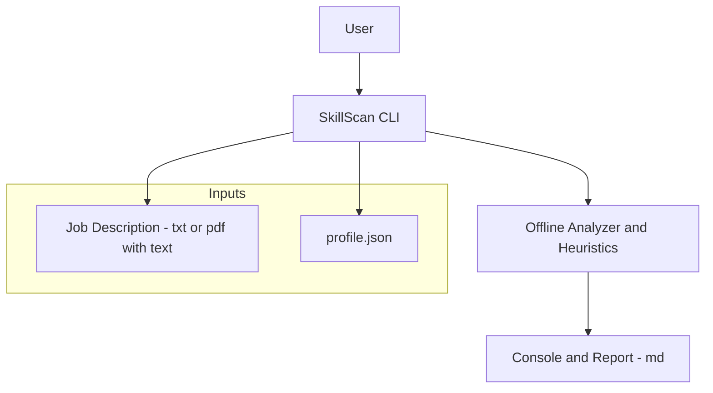

# Tech context

> One-page overview of the confirmed technology choices, constraints, and the architecture used by SkillScan.

## Stack

- **Language & runtime:** Python (CLI).
- **Execution mode:** Local, **offline-by-default**.
- **Project artifacts:** Markdown docs + plain text; no external services.
- **Governance:** Conventional Commits (Angular), SemVer + CHANGELOG.

> Note: For **v0.1.0**, the project **officially adopts `pypdf`** as the offline PDF dependency (no OCR).
> Additional CLI/testing/linting tools will be documented here only when they are truly adopted in code.

## Operating constraints

- **Offline by default**: no external calls.
- **Supported PDFs**: **only** PDFs with **selectable text**
  (scanned/OCR PDFs are out of scope for now).
- **Accepted inputs**:

  - **Job Description**: `.txt` or `.pdf` (with selectable text).
  - **Profile**: `profile.json`.

- **Outputs**:

  - Result displayed in the **console** and/or as a **Markdown report**.

- **Error messages**: must clearly indicate limitations (e.g., PDF has no text, invalid path, malformed JSON).

> Decision formalized in **ADR-0001** (offline & PDF policy).

## Architecture overview

The vision is a **command-line tool** that reads inputs, applies local rules/heuristics, and produces a report for the user.

## **How the pieces fit together**

1. The user runs the **CLI** locally.
2. The CLI loads the **JD** (text) and **profile.json**.
3. The **Analyzer/Heuristics** processes the data **without network access** (offline mode).
4. The tool displays the result in the **console** and may generate a **.md report**.

## Non-goals (for now)

- **No OCR** for scanned PDFs.
- **No API/LLM calls** or external integrations.
- **No Web UI** or local API in this version.
- **No data persistence** beyond the provided/generated files.

## Related docs

- `context/project-brief.md` — scope, objectives, DoD, and roadmap.
- `context/product-context.md` — purpose and personas.
- `adrs/0001-offline-and-pdf-policy.md` — decision on offline mode and PDFs.
- `README.md` — installation, usage, formats, and limitations.
- `CHANGELOG.md` — version history.
- `CONTRIBUTING.md` — commit, issue, and PR standards.
