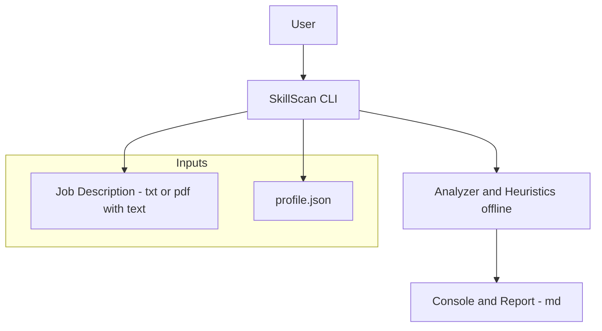

# Tech context

> One-page overview of the confirmed technology choices, constraints and the architecture used by SkillScan.

## Stack

* **Language & runtime:** Python (CLI).
* **Execution mode:** Local, **offline-by-default**.
* **Project artifacts:** Markdown docs + plain text; no external services.
* **Governance:** Conventional Commits (Angular), SemVer + CHANGELOG.

> Nota: não foram especificadas libs específicas (CLI, PDF, testes, lint). Quando forem realmente adotadas no código, este documento será atualizado.

## Operating constraints

* **Offline por padrão**: nenhuma chamada externa.
* **PDFs suportados**: **apenas** PDFs com **texto selecionável**
  (PDFs escaneados/OCR estão fora do escopo atual).
* **Entradas aceitas**:

  * **Job Description**: `.txt` ou `.pdf` (com texto selecionável).
  * **Profile**: `profile.json`.
* **Saídas**:

  * Resultado no **console** e/ou **relatório** em Markdown.
* **Mensagens de erro**: devem indicar claramente limitações (ex.: PDF sem texto, caminho inválido, JSON mal-formado).

> Decisão formalizada no **ADR-0001** (offline & PDF policy).

## Architecture overview

A visão é de **ferramenta de linha de comando** que lê os insumos, aplica regras/heurísticas locais e produz um relatório para o usuário.

## **Como as peças se encaixam**

1. Usuário executa o **CLI** localmente.
2. O CLI carrega **JD** (texto) e **profile.json**.
3. O **Analyzer/Heuristics** processa os dados **sem rede** (modo offline).
4. A ferramenta exibe o resultado no **console** e pode gerar **report .md**.

## Non-goals (por enquanto)

* **Sem OCR** para PDFs escaneados.
* **Sem chamadas a APIs/LLMs** ou integrações externas.
* **Sem Web UI** nem API local nesta versão.
* **Sem persistência de dados** além dos arquivos fornecidos/gerados.

## Related docs

* `context/project-brief.md` — escopo, objetivos, DoD e roadmap.
* `context/product-context.md` — propósito e personas.
* `adrs/0001-offline-and-pdf-policy.md` — decisão sobre modo offline e PDFs.
* `README.md` — instalação, uso, formatos e limitações.
* `CHANGELOG.md` — histórico de versões.
* `CONTRIBUTING.md` — padrão de commits, issues e PRs.
